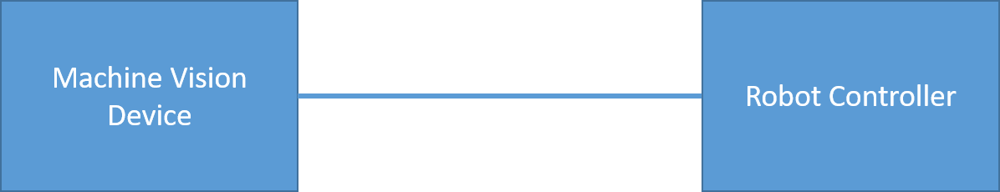

# 3. Robot Vision Basics

Machine Vision Devices can communicate with or without the wenglor robot server. The robot server runs directly on each Machine Vision Device, and its settings can be accessed via the device website. For every processing instance, the robot server is available under the `Jobs` tab. For further details, please refer to your Machine Vision Device's operating instructions.

Without the wenglor robot server (see chapter [4. Without wenglor Robot Server](4_0_0_without_wenglor_robot_server.md)):

- Communication to any robot manufacturer supporting TCP socket messaging.
- Camera on robot or not on robot.
- Mount the camera parallel to the measuring or picking plane (tilted mounting is not supported).
- Three-point calibration on robot side to define the measuring or picking plane.
- Use `Module Image Coordinate System` within the uniVision job to align the coordinate systems of camera and robot.
- Use `Module Image Calibration` within the uniVision job to eliminate the lens distortion and to calculate in mm. It requires one or several images of the calibration plate [ZVZJ](https://www.wenglor.com/en/Accessories/Optics-Filters-Deflectors-and-Focusers/Calibration-Plates/c/cxmCID222488). Buy the product ZVZJ (recommended) or print the corresponding PDF yourself onto flat, stiff material.
- Use Device TCP within the uniVision job for communication to the robot controller via socket messaging.

<figure class="align-left">
  
</figure>

With the wenglor robot server (see chapter [5.1 Basics with Robot Server](5_1_0_basics_with_robot_server.md)):

- Communication to supported robot manufacturers (listed in the dropdown of Robot Manufacturer on the device website of the Machine Vision Device at the tab `Jobs`). Using `Generic` in the dropdown allows the communication to further robot manufacturers via the generic string based robot vision API (see chapter [5.6 Generic Robot Vision API](5_6_0_generic_robot_vision_api.md)).
- Camera on robot or not on robot.
- If the camera is tilted towards the measuring or picking plane, the calibration compensates for this. Extreme angles should be avoided.
- Hand-eye calibration of robot and camera via several calibration poses where the camera looks at the calibration plate from different positions and angles. Buy one of the different calibration plates [ZVZJ](https://www.wenglor.com/en/Accessories/Optics-Filters-Deflectors-and-Focusers/Calibration-Plates/c/cxmCID222488) (recommended) or print the corresponding PDF yourself onto flat, stiff material.
- Calibration (including elimination of lens distortion and calculating in mm) is done within the robot server (no separate `Module Image Calibration` within the [uniVision](https://www.wenglor.com/en/Machine-Vision/Machine-Vision-Software/Image-Processing-Software-uniVision-3/c/cxmCID222459) job is required).
- Use `Device Robot Vision` within the [uniVision](https://www.wenglor.com/en/Machine-Vision/Machine-Vision-Software/Image-Processing-Software-uniVision-3/c/cxmCID222459) job for the communication to the robot server.

<figure class="align-left">
  
</figure>

The following basics are relevant for both cases:

- Mount the camera on the robot ([ZVZC001](https://www.wenglor.com/product/ZVZC001)) or not on the robot. For details about mounting options, check the product detail page of the Machine Vision Devices ([B60](https://www.wenglor.com/en/Machine-Vision/Smart-Cameras-and-Vision-Sensors/Smart-Camera-B60/c/cxmCID221375) and [Machine Vision Cameras](https://www.wenglor.com/en/Machine-Vision/Machine-Vision-Cameras/c/cxmCID221382)).
- Make sure to use robot-compatible cables. For details, check the product detail page of the Machine Vision Device.
- For safe cable management, use the joint limits in the safety settings of the robot.
- Set the payload on the robot (if necessary).
- Teach the robot TCP (tool center point) in relation to the robot world coordinate system.

<figure class="align-left">
  
</figure>

!!! note

    Make sure that the mechanical setup of camera, robot and picking plane is unchanged after the calibration. Otherwise, recalibration is necessary.
