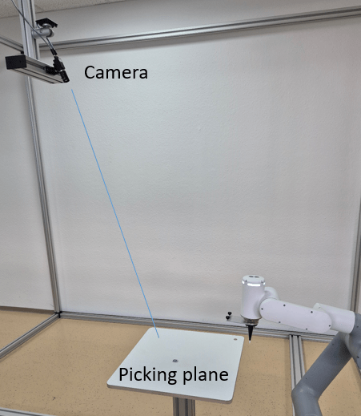
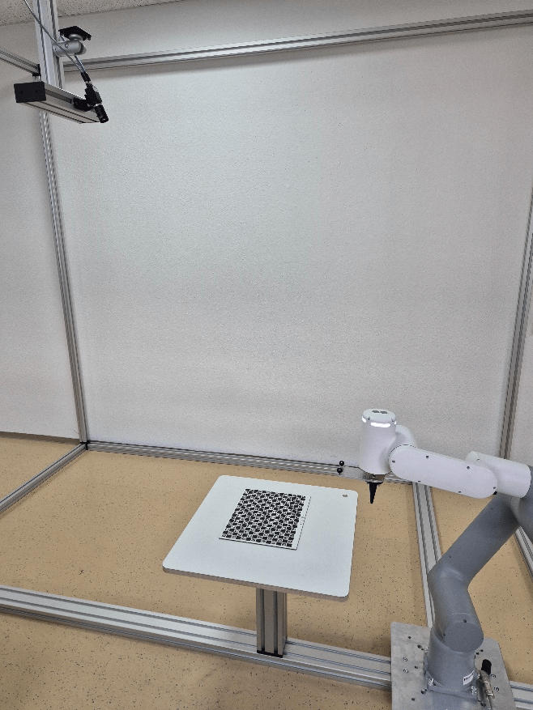

# 4. Wenglor Robot Server

The wenglor robot server supports the communication to specific robot manufacturers. For details, check the dropdown list of robot manufacturers on the device website of the Machine Vision Device and the operating instructions of the device. Using `Generic` in the dropdown allows the communication to further robot manufacturers via the generic string-based robot vision API (see chapter [4.7 Generic Robot Vision Interface](4_7_0_generic_robot_vision_interface.md)).

It is possible to mount the camera on the robot or not on the robot. The camera can also be slightly tilted towards the measuring or picking plane.

<figure class="align-left">

</figure>

Calibrate the robot and camera via several calibration poses where the camera looks from different positions on the calibration plate (hand-eye calibration). Buy one of the different calibration plates [ZVZJ](https://www.wenglor.com/en/Accessories/Optics-Filters-Deflectors-and-Focusers/Calibration-Plates/c/cxmCID222488) (recommended) or print the corresponding PDF yourself onto flat, stiff material. The calibration is done inside the wenglor robot server, including the compensation of the lens distortion and the calculations in mm (`Module Image Calibration` is not needed within the uniVision job). Use `Device Robot Vision` within the uniVision job to send results (coordinates of found objects) to the robot server.

<figure class="align-left">

</figure>

!!! note

    - In case of printing your calibration plate, make sure to print the PDFs at actual size and on a stiff and flat material.
    - Typically, the reprojection error for the ZVZJ calibration plate is five times smaller compared to the printed version.
    - For direct light applications, non-transparent calibration plates made of carbon fiber are available. For backlight applications, transparent calibration plates with the material glass are available.
    - The calibration plate should cover at least half of the image and should be visible completely by the camera if possible for most accurate results.

Consider the following points when setting the calibration poses:

- Ensure the calibration plate is in the field of view of the camera when setting the poses.
- Make sure that the difference between one pose and the next one is as big as possible for the best accurate results. The same pose could be used several times if not consecutive (e.g., pose one and three can be similar). If space is limited in the application, small differences between one pose and the next one are also possible but result in less accurate results.
- The calibration plate should cover as much as possible of the camera image and should be visible completely if possible for the most accurate results.

The calibration process differs depending on whether the camera is mounted on the robot (see [4.1 Camera on Robot](4_1_0_camera_on_robot.md)) or not on the robot (see [4.2 Camera not on Robot](4_2_0_camera_not_on_robot.md)).
