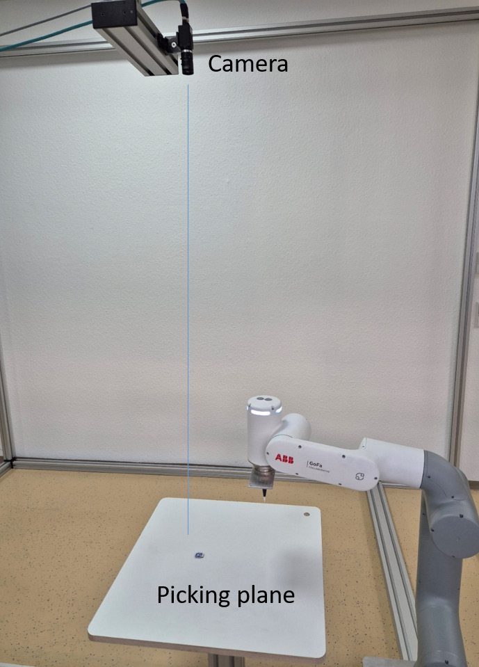
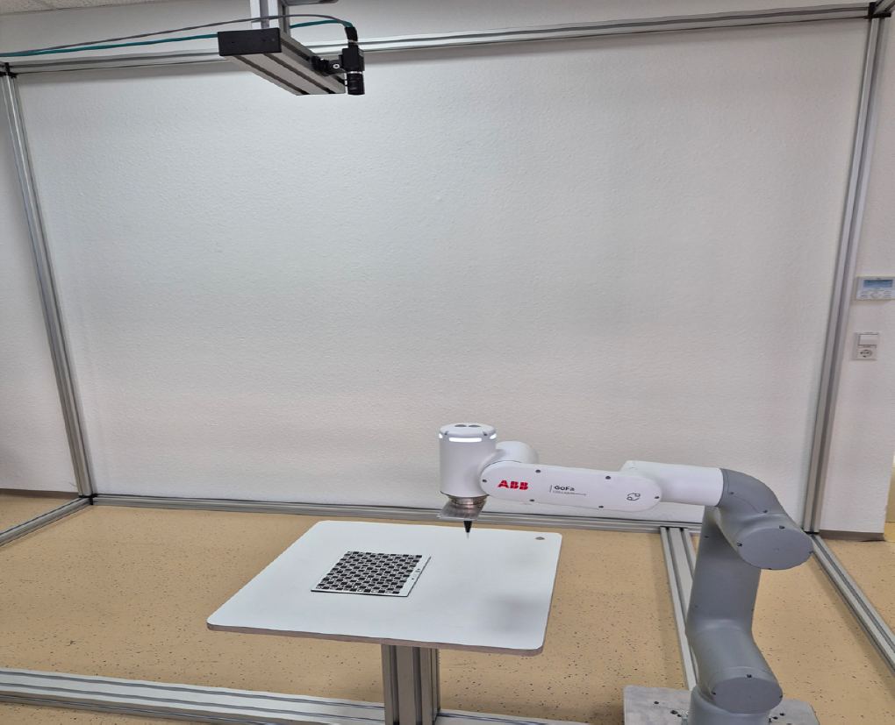

# 4. Without wenglor Robot Server

Without the wenglor robot server, the communication between robot and camera works via socket messaging for any robot manufacturer. Use one port for sending LIMA commands (e.g., to send trigger commands from the robot to the camera) and another port to receive process data from the camera (e.g., picking coordinates) via Device TCP.

The camera can be mounted on the robot or not on the robot. It is important that the camera is parallel to the measuring or picking plane (tilted mounting is not supported). Three points define the picking plane for the robot.

<figure class="align-left">
  
</figure>

Make sure to align the coordinate systems of the robot and the camera via `Module Image Coordinate System` within the uniVision job. Use `Module Image Calibration` within the uniVision job to eliminate the lens distortion and to calculate the coordinates in mm. It requires one or several images of the calibration plate [ZVZJ](https://www.wenglor.com/en/Accessories/Optics-Filters-Deflectors-and-Focusers/Calibration-Plates/c/cxmCID222488). Buy the product ZVZJ (recommended) or print the corresponding PDF on a flat and stiff material yourself. Use Device TCP to send the process data (e.g., coordinates of found object) to the robot.

<figure class="align-left">
  
</figure>
