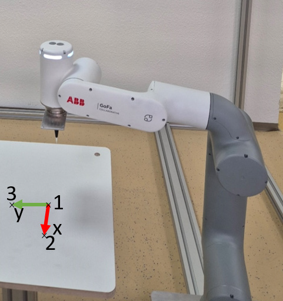
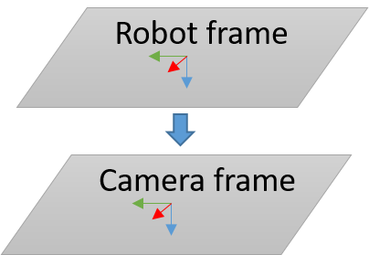

# 4.1 Three-Point Calibration at Robot

Calibrate the camera to the robot by creating a base frame on the robot side that overlaps with the camera frame. Create the base frame at the robot via three points directly on the measuring or picking plane and mark it, if needed, so that it is visible in the camera image:

1. Reference point
2. Point in x direction based on the reference point
3. Point in y direction based on the reference point

<figure class="align-left">
  
</figure>

!!! note

    Make sure to use the same origin and the same orientation for the robot frame and the camera frame. `Module Image Coordinate System` defines the coordinate system of the camera (see [4.2 Job in uniVision](4_2_0_job_in_univision.md)).

<figure class="align-left">
  
</figure>