# 4.2 Camera not on Robot

This chapter describes the calibration and detection process for a camera mounted independently of the robot (eye-to-hand), including the use case of camera and robot mounted on a mobile platform.

## Calibration use case

If the camera is not on the robot, the calibration process consists of two steps.

For the first step of the calibration process, mount the calibration plate on the robot. Teach a minimum of five calibration poses (e.g., seven to eleven poses). For more accurate results, teach further calibration poses.

<table>
<tr>
<td>
<figure>
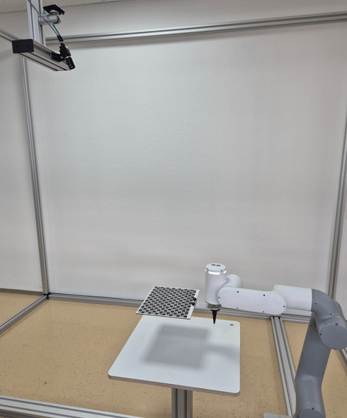
<figcaption>Calibration pose 1</figcaption>
</figure>
</td>
<td>
<figure>
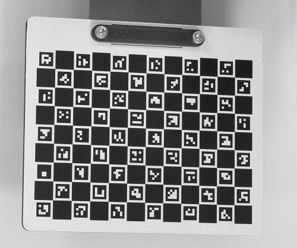
</figure>
</td>
</tr>
</table>

<table>
<tr>
<td>
<figure>
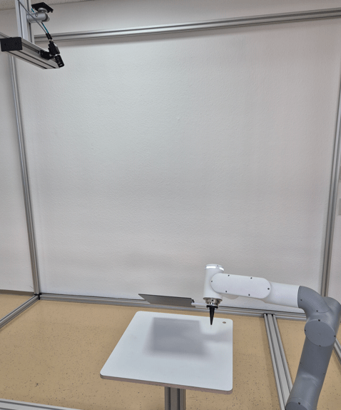
<figcaption>Calibration pose 2</figcaption>
</figure>
</td>
<td>
<figure>
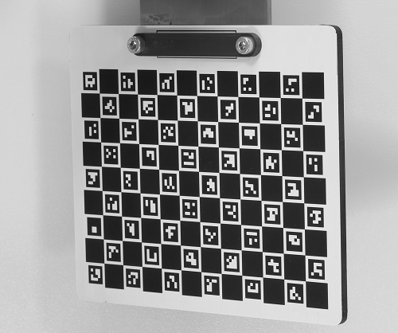
</figure>
</td>
</tr>
</table>

<table>
<tr>
<td>
<figure>
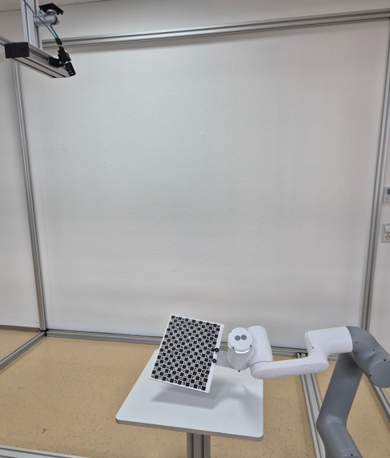
<figcaption>Calibration pose 3</figcaption>
</figure>
</td>
<td>
<figure>
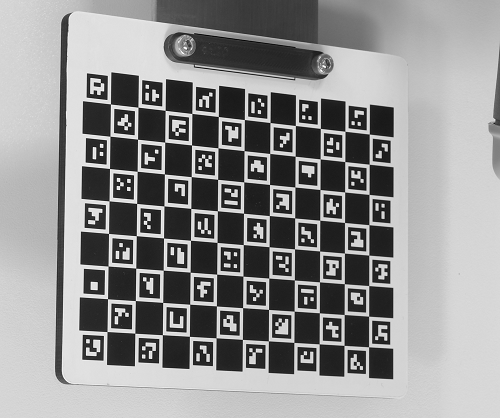
</figure>
</td>
</tr>
</table>

<table>
<tr>
<td>
<figure>
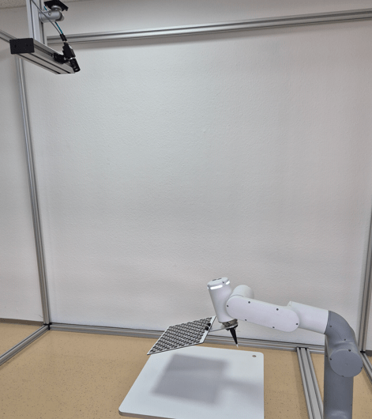
<figcaption>Calibration pose 4</figcaption>
</figure>
</td>
<td>
<figure>
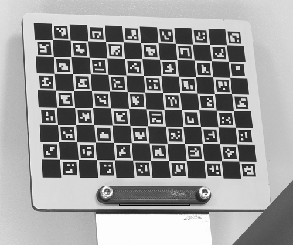
</figure>
</td>
</tr>
</table>

<table>
<tr>
<td>
<figure>
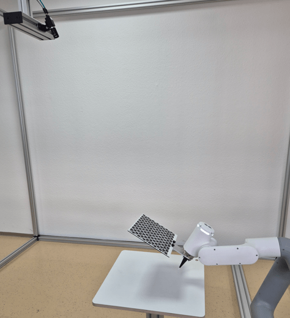
<figcaption>Calibration pose 5</figcaption>
</figure>
</td>
<td>
<figure>
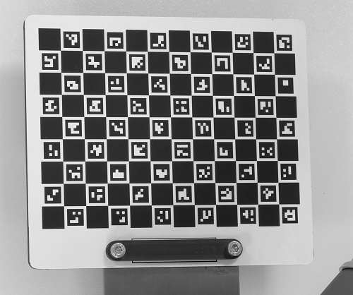
</figure>
</td>
</tr>
</table>

For the second step of the calibration process, put the calibration plate on the measuring or picking plane and capture one single image.

<figure class="align-left">
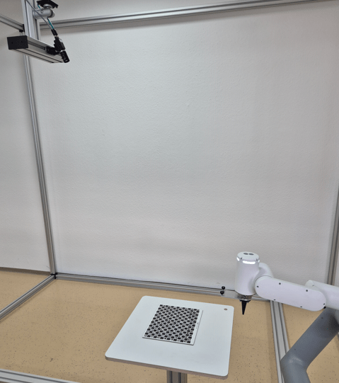
</figure>

After running the calibration, an optional verification step is possible to check the accuracy of the calibration. Applying it moves the robot TCP to the bottom left corner of the calibration plate (with an adjustable safety height offset). It is necessary that the calibration plate was not moved between the second calibration step and the verification step. In case of bad results, check the setup and rerun the calibration.

!!! note

    - For the verification step, the z axis must point to the object plane. In tilted settings, the Z-axis of the TCP will be perpendicular to the object plane.
    - The reprojection error shows how good the calibration was. Typical values are 0.1 for ZVZJ calibration plates and 0.5 for printed calibration plates.

## Detect use case

After successful calibration, pick your objects. Use any detection pose where the camera sees the objects.

<figure class="align-left">
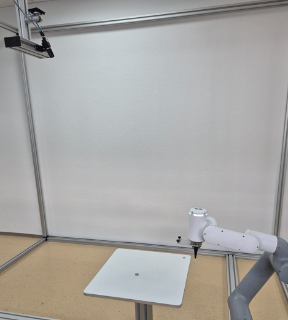
</figure>

With the object position sent by the camera, move the robot to the object.

<figure class="align-left">
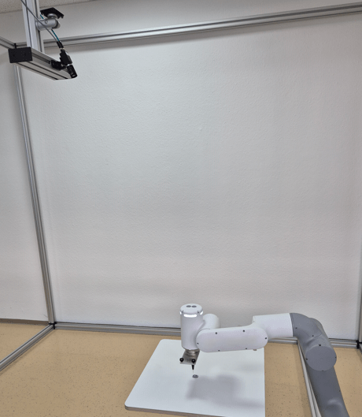
</figure>

## Mobile platform use case

Further use case, e.g. to correct positional deviations of mobile platforms in front of a machine or shelf.

<figure class="align-left">
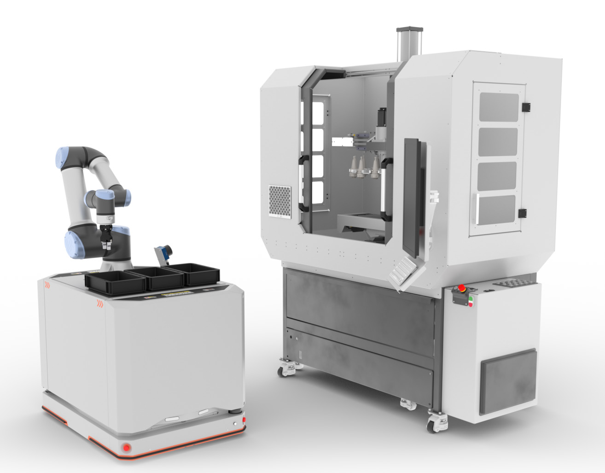
</figure>

If using camera and robot on a mobile platform, make sure that the calibration plate is mounted fixed at each machine or shelf as a reference position. Run the normal first calibration step once at the beginning with several different poses with big variations (especially differences in the pose angles) when the calibration plate is mounted on the robot. Also run the second calibration step once, e.g. when the camera sees the calibration plate at the machine. Afterwards, in the run use case, when the mobile platform is in front of the machine or shelf, the camera captures only one image of the calibration plate and calculates the positional deviation of the mobile platform towards the target position. Use this info to update the reference frame of the machine or shelf if the handling pose is fixed.

In case of variating handling poses at mobile platforms, it is possible to calibrate the camera-to-target relation and afterwards use the detect command. Run the normal first calibration step once at the beginning with several different poses with big variations (especially differences in the pose angles). Also run the second calibration step once, e.g. when the camera sees the calibration plate at the machine. Afterwards, in the run use case, the camera captures only one image of the calibration plate and then captures another image via the detect command for flexible object picking. Make sure that the position of the mobile platform is unchanged between calibrating the camera to the calibration target and detecting the object.

!!! note

    - It is also possible to mount camera and robot in the machine. Then the calibration plate must be at a fixed reference position on the mobile platforms or on the boxes.
    - For unique identification of the machine, the shelf, or the mobile platform, it is possible to label them, e.g., with codes. The camera can read the code and send it to the robot as additional info. The code result must be linked to the additional value in `Device Robot Vision` in the uniVision job.
