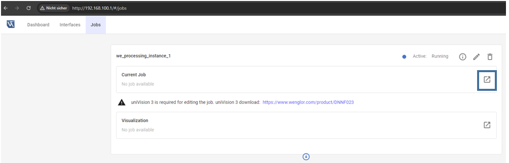
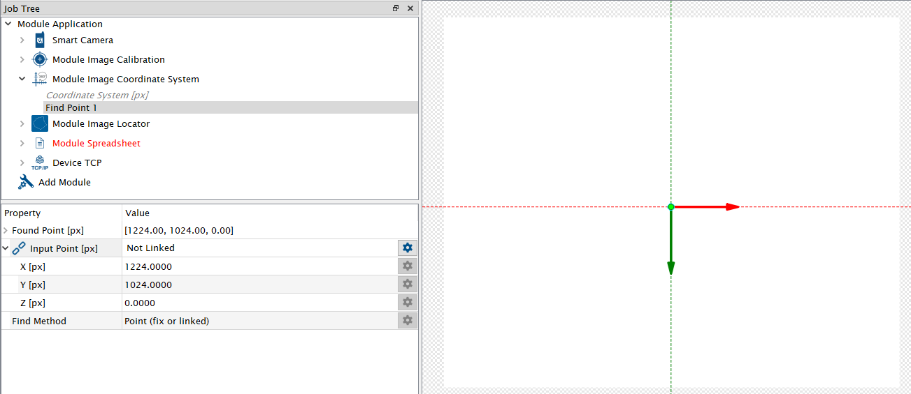
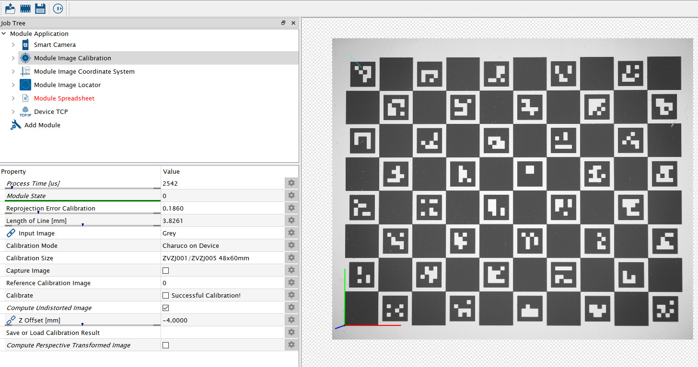
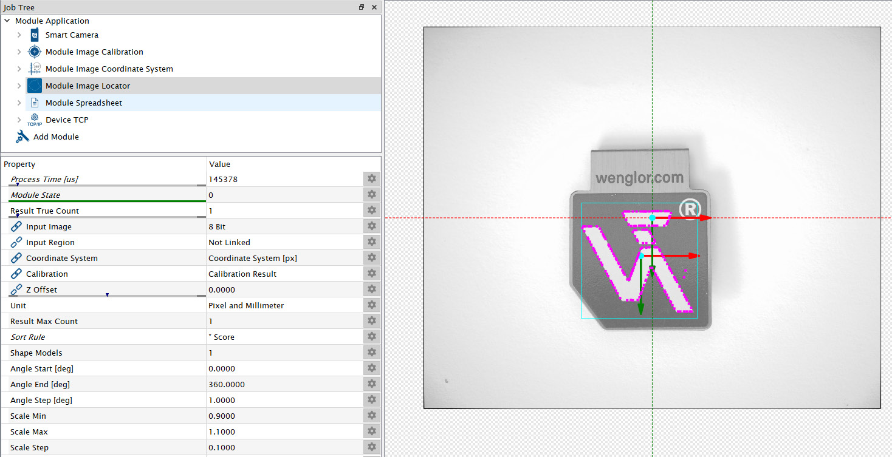
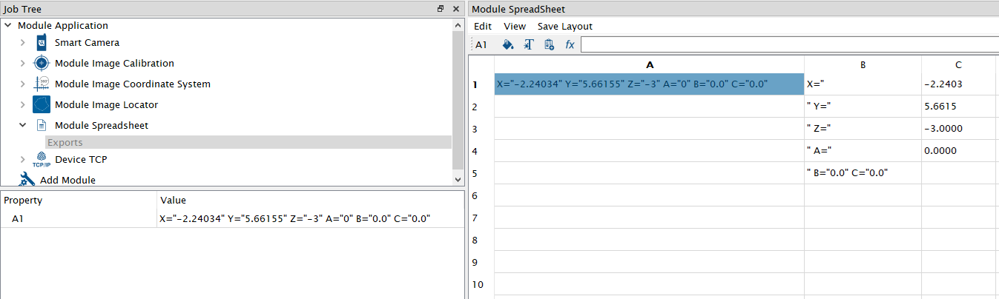
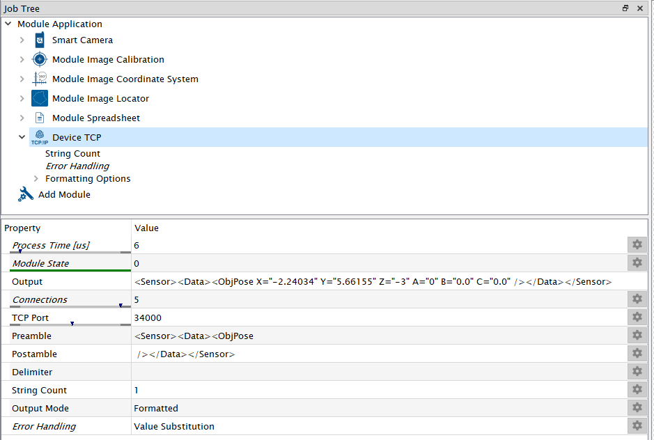

# 4.2 Job in uniVision

Open the device website of the Machine Vision Device (by entering the IP address in the browser, by default `192.168.100.1`), access the tab `Jobs`, and open the current job in the [uniVision 3 software](https://www.wenglor.com/en/Machine-Vision/Machine-Vision-Software/Image-Processing-Software-uniVision-3/c/cxmCID222459).

<figure class="align-left">
  
</figure>

Load the template `Pick objects with generic robot` for easy setup.

Adjust the focus and brightness of the camera to get a sharp and well-illuminated image. By default, `Trigger Mode` is set to `On` and `Trigger Source` to `Software` (mandatory for picking). Set `Trigger Mode` to `Off` in order to adjust the camera image. Afterward, change the setting back to Software trigger.

Use `Module Image Coordinate System` in order to create a common frame between camera and robot. By default, the origin of the coordinate system is in the center of the camera image (if using a 5 MP camera). Use the same coordinate system at the robot (see [4.1 Three-Point Calibration at Robot](4_1_0_three_point_calibration_at_robot.md)). Use your markings on the picking plane to adjust the coordinate system.

<figure class="align-left">
  
</figure>

Use `Module Image Calibration` to eliminate the lens distortion and to calculate the coordinates in mm. Buy the calibration plate [ZVZJ](https://www.wenglor.com/en/Accessories/Optics-Filters-Deflectors-and-Focusers/Calibration-Plates/c/cxmCID222488) (recommended) or print the corresponding PDF yourself on a flat and stiff material. Put the calibration plate in the field of view of the camera. Select the corresponding size of the calibration plate ZVZJ at `Module Image Calibration`, click on `Capture Image` and afterward on `Calibrate`. The Z Offset of -4 mm compensates for the height of the calibration plate ZVZJ. Adjust it if the height of your calibration plate is different.

<figure class="align-left">
  
</figure>

Put your picking object below the camera and teach it in `Module Image Locator` (at sub-module `Shape Models`). Then, `Module Image Locator` finds the object according to the parameters.

<figure class="align-left">
  
</figure>

Use `Module Spreadsheet` to create one string with the coordinates x, y and z and the rotations A, B and C. Enter the height of the picking object at Z. The following example works with robots based on XML communication (tested with KUKA robots). In general, the robot programmer and the user configuring the Machine Vision Device must agree on a common protocol.

<figure class="align-left">
  
</figure>

Use Device TCP to send the result via socket messaging to the robot.

<figure class="align-left">
  
</figure>

!!! note

    For details about uniVision 3, check the separate operating instructions of the software [wenglor uniVision 3 (DNNF023)](https://www.wenglor.com/en/Machine-Vision/Machine-Vision-Software/Image-Processing-Software-uniVision-3/wenglor-uniVision-3-Software/p/DNNF023).

Save the job in the projects folder of the Machine Vision Device.
