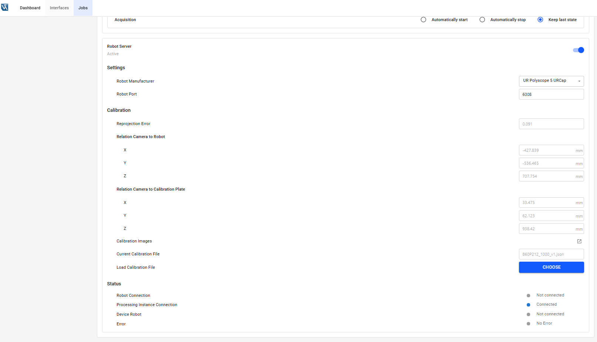
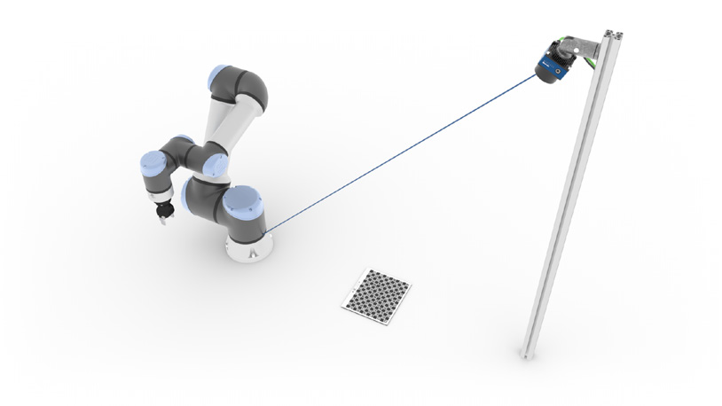
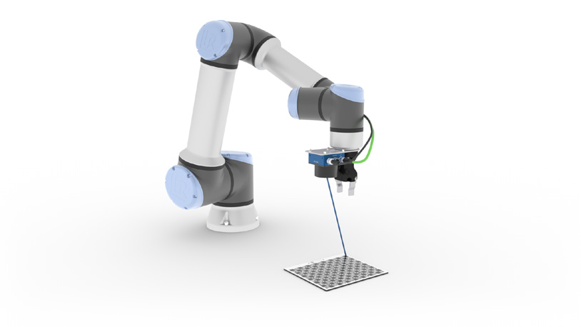
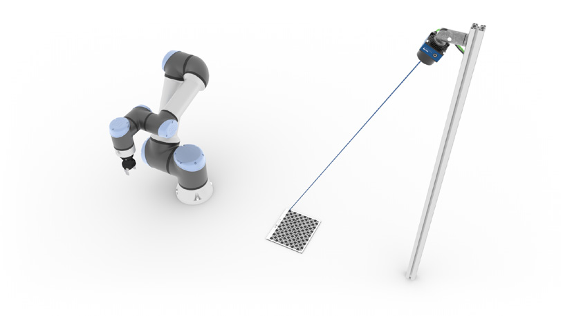

# 5.2 Settings on Device Website

Open the device website of the Machine Vision Device and select the tab `Jobs` to see the robot server settings for each processing instance.

<figure class="align-left">

</figure>

In the `Robot Server` section at the bottom of the `Jobs` tab, activate the robot server, if needed. By default, the robot server is active on the [Smart Camera B60](https://www.wenglor.com/B60) and inactive on the [Machine Vision Controller MVC](https://www.wenglor.com/MachineVisionController). Additional parameters appear if activated:

## Settings

- **Robot Manufacturer**: Select the relevant robot manufacturer (UR Polyscope 5 URCap, UR Polyscope X Script, KUKA, ABB, Kassow Robots, FANUC or Generic).
- **Robot Port**: Depending on the robot manufacturer, the default port is shown. Edit the port, if needed (e.g., in case of port conflicts at several processing instances on the [Machine Vision Controller MVC](https://www.wenglor.com/MachineVisionController)). Make sure to use a unique port. If the port is already in use, change the port and wait approximately one minute for the error to disappear.
- **Reprojection Error**: Returns the reprojection error of the internal camera calibration. The smaller the value, the better the accuracy.
- **Relation Camera to Robot**: Returns the distance from the camera to the robot.
<table>
<tr>
<td>
<figure>

<figcaption>On Robot: Camera to robot TCP</figcaption>
</figure>
</td>
<td>
<figure>

<figcaption>Not on Robot: Camera to robot base</figcaption>
</figure>
</td>
</tr>
</table>

- **Relation Camera to Calibration Plate**: Returns the distance from the camera to the origin of the calibration plate.

<table>
<tr>
<td>
<figure>

<figcaption>On Robot: Camera to calibration plate origin</figcaption>
</figure>
</td>
<td>
<figure>

<figcaption>Not on Robot: Camera to calibration plate origin</figcaption>
</figure>
</td>
</tr>
</table>

- **Calibration Images**: Opens a new browser tab showing the calibration images (`File Management` -> `Calibration`).
- **Current Calibration File**: Shows the name of the currently loaded calibration file.
- **Load Calibration File**: Load another calibration file. The calibration file is only valid for one specific device, and only as long as the relation between camera, lens, and robot is unchanged (e.g. it becomes invalid if the camera position changes, or if the lens changes — e.g. via a different focus position on [B60](https://www.wenglor.com/B60) autofocus devices).

## Status

- **Robot Connection**: Shows if the robot controller is connected to the robot server or not.
- **Processing Instance Connection**: Shows if the robot server is connected to the processing instance via the LIMA Read Write Limited port or not.
- **Device Robot**: Shows if the robot server is connected to `Device Robot Vision` or not.
- **Error**: Shows if there is any error (e.g., if calibration file does not fit the device).
