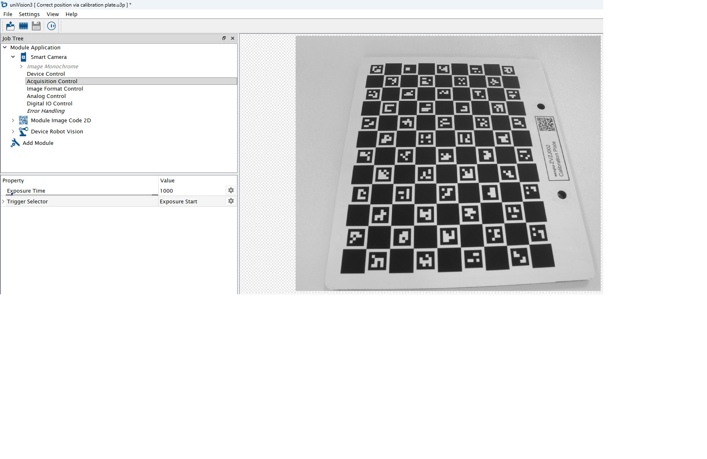
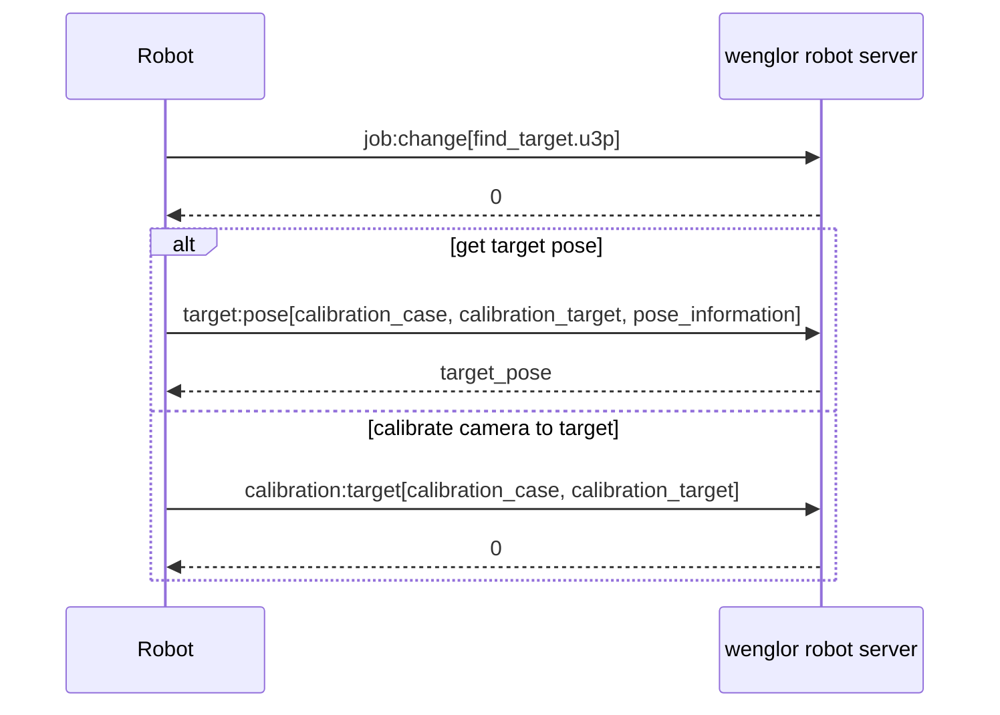

# 5.5 Job in uniVision to Get Target Pose or Calibrate Camera to Target

This job is used for the `target:pose` and `calibration:target` commands of the [Generic Robot Vision API](5_6_0_generic_robot_vision_api.md). It is typically used when the camera and robot are mounted on a mobile platform: the robot detects the calibration target to correct its position relative to a machine or shelf, or to calibrate the camera-to-target relation without creating a new persisted calibration file.

If the camera and robot are mounted on a mobile platform, load the template `Correct position via calibration plate`.

Adjust the focus and brightness of the camera to get a sharp and well-illuminated image. By default, Trigger Mode is set to `On` and Trigger Source to `Software`. Adjust `Trigger Mode` to `Off` and switch to `Run Mode` in order to adjust the camera image. Afterward, change `Trigger Source` back to `Software`. If working with color images, make sure that `Create BGRA Image` is active at the input camera (only relevant if working with URCap).

<figure class="align-left">

</figure>

Make sure that `Device Robot Vision` is part of the uniVision job. Optionally, link any job result as `Additional Value` in `Device Robot Vision` (Result List → 0) to identify the current position (e.g. via linking a code result). Make sure that `Shape Model` of result `0` in the Result List is set to a valid value (e.g. `0`) and that `Result True Count` is linked with the corresponding value (e.g. `Result True Count` of the code module).

Save the job in the device projects folder on the Machine Vision Device so that the robot can load it later.

## Command exchange

- `target:pose[...]` returns the 3D pose of the calibration target (`target_pose`), which the robot typically assigns to a reference frame or coordinate offset. It also fills the additional value internally, accessible via `value:get[0]`.
- `calibration:target[...]` recalculates the camera-to-target relation and caches it internally in the camera, without writing a new calibration file to the Machine Vision Device.

See [5.6 Generic Robot Vision API](5_6_0_generic_robot_vision_api.md#command-syntax) for the full command reference.
