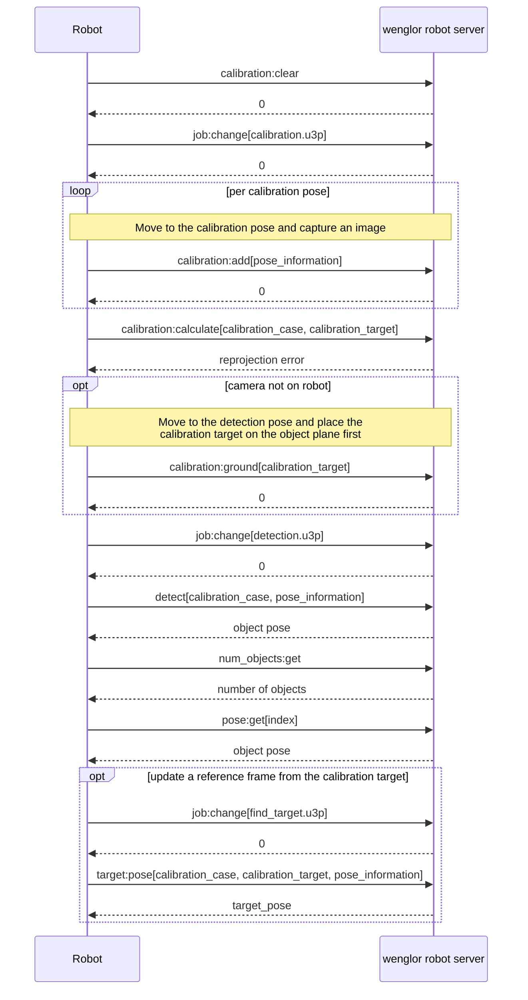

# 5.6 Generic Robot Vision API

The generic robot vision API describes the communication between the robot controller and the wenglor robot server on the Machine Vision Device.

## Usage
Select the robot manufacturer `Generic` on the device website (tab `Jobs`, section `Robot Server`, see section [5.2 Settings on Device Website](5_2_0_settings_on_device_website.md)) in order to use the generic string-based robot vision API.

!!! note

    The Python robot example for the generic string-based robot vision API is available in the related [GitHub Repository](https://github.com/wenglor/robot-vision-generic-string/tree/main/sources)

## Communication sequence

Typical sequence of commands exchanged between the robot controller and the wenglor robot server for a
calibration followed by a detection:



See [5.5 Job in uniVision to Get Target Pose or Calibrate Camera to Target](5_5_0_target_pose_and_camera_to_target.md) for `target:pose` and `calibration:target` in detail.

## Command syntax

Overview of commands for string- and XML-based robots:

| Command | Description | Unit/Note |
| ---------------------------------------------------------------- | ------------------------------------------------------------------------------------------------------------------------------------------------------------------------------------------- | ---------------------------------------------------------------------------------------------------------------------------------------------------------------------------------------------------------------------------------------------------------------------------------------------------------------------------------------------------------------------------------------------------------------------------------------------------------------------------------------------------------------------------------------------------------------------------------------------------------------- |
| job:change[*job_name.u3p*]; | Changes the [uniVision](https://www.wenglor.com/en/Machine-Vision/Machine-Vision-Software/Image-Processing-Software-uniVision-3/wenglor-uniVision-3-Software/p/DNNF023) job of the processing instance to the given job. | File ending ".u3p" is mandatory. Do not wrap the job name in quotes |
| job:get; | Requests the currently active job of the processing instance. | String |
| calibration:clear; | Clears the internal buffer of the robot server.  Required in case of recalibration. | |
| calibration:add[*pose_information*]; | Triggers and saves the current camera image together with the given robot pose in the internal buffer of the robot server. | Pose information in [x, y, z, rx, ry, rz] x, y, z in meter rx, ry, rz as rotation vector in radians |
| calibration:calculate[*calibration_case*, *calibration_target*]; | Calculates the hand-eye calibration based on the saved calibration poses and images from the internal buffer of the robot server. The results are stored on the Machine Vision Device. | Calibration case options: <ul><li>camera_on_robot</li><li>camera_not_on_robot </li></ul> Calibration target options: <ul> <li>[ZVZJ001](https://www.wenglor.com/product/ZVZJ001)</li> <li>[ZVZJ002](https://www.wenglor.com/product/ZVZJ002)</li> <li>[ZVZJ003](https://www.wenglor.com/product/ZVZJ003)</li> <li>[ZVZJ004](https://www.wenglor.com/product/ZVZJ004)</li></ul>  <blockquote> NOTE<br>For [ZVZJ005](https://www.wenglor.com/product/ZVZJ005) use [ZVZJ001](https://www.wenglor.com/product/ZVZJ001) <br>For [ZVZJ006](https://www.wenglor.com/product/ZVZJ006) use [ZVZJ002](https://www.wenglor.com/product/ZVZJ002) (same size) </blockquote> |
| calibration:ground[*calibration_target*]; | Triggers the [uniVision](https://www.wenglor.com/en/Machine-Vision/Machine-Vision-Software/Image-Processing-Software-uniVision-3/c/cxmCID222459) job, calculates and saves the current calibration target pose as an object ground reference. | Calibration target options: <ul> <li>[ZVZJ001](https://www.wenglor.com/product/ZVZJ001)</li> <li>[ZVZJ002](https://www.wenglor.com/product/ZVZJ002)</li> <li>[ZVZJ003](https://www.wenglor.com/product/ZVZJ003)</li> <li>[ZVZJ004](https://www.wenglor.com/product/ZVZJ004)</li></ul>  <blockquote> NOTE<br>For [ZVZJ005](https://www.wenglor.com/product/ZVZJ005) use [ZVZJ001](https://www.wenglor.com/product/ZVZJ001) <br>For [ZVZJ006](https://www.wenglor.com/product/ZVZJ006) use [ZVZJ002](https://www.wenglor.com/product/ZVZJ002) (same size) </blockquote> |
| state[*calibration_case*]; | Requests the state of the robot server. The first bit represents whether a camera error is present, which includes a camera connection error. The second bit represents if a calibration is present for the provided use case or not. | Calibration case options: <ul><li>camera_on_robot </li> <li>camera_not_on_robot </li></ul> First bit: Camera error state (includes a camera connection error) <ul> <li>0: No camera error present </li> <li>1: Camera is in error state </li></ul> Second bit: Calibration state <ul><li>0: No calibration present </li> <li>1: Calibration data could be read </li></ul> Example: 01 <ul><li>0: No camera error </li> <li>1: Calibration available </li></ul> Example: 10 <ul><li>1: Camera in error state </li> <li>0: Calibration not available </li></ul> Example: 11 <ul> <li>1: Camera in error state </li> <li>1: Calibration available </li></ul> |
| detect[*calibration_case*, *pose_information*]; | Triggers the [uniVision](https://www.wenglor.com/en/Machine-Vision/Machine-Vision-Software/Image-Processing-Software-uniVision-3/c/cxmCID222459) job, sends the `Device Robot Vision` data to the robot server. The robot server then calculates the 3D object pose based on the current calibration data and returns it to the robot. | Calibration case options: <ul><li>camera_on_robot</li> <li>camera_not_on_robot </li></ul>Pose information in [x, y, z, rx, ry, rz] <br> x, y, z in meter <br> rx, ry, rz as rotation vector in radians <br><br> Object pose (array of floating point numbers) |
| num_objects:get; | Requests the number of objects available in the robot server buffer | Positive number |
| validate[*calibration_case*, *detection_pose*]; | Provides the calibration target origin 3D pose (bottom-left corner of the calibration target) based on the information saved during the calibration. Unlike the other commands, `validate` requires the detection pose rather than the current robot pose. | Calibration case options: <ul><li>camera_on_robot </li> <li>camera_not_on_robot </li></ul> Pose information in [x, y, z, rx, ry, rz] <br> x, y, z in meter <br> rx, ry, rz as rotation vector in radians <br><br> Calibration target pose (array of floating point numbers) |
| pose:get[*index*]; | Requests the object pose with the given index from the robot server buffer. Detect must be called first to fill the buffer. | Index starts at 0 <br> Pose information in [x, y, z, rx, ry, rz] <br> x, y, z in meter <br> rx, ry, rz as rotation vector in radians <br><br> Object pose (array of floating point numbers) |
| shape:get[*index*]; | Requests the shape model with the given index from the robot server buffer. Detect must be called first to fill the buffer. | Index starts at 0 <br><br> Number |
| value:get[*index*]; | Requests the additional value with the given index from the robot server buffer. Detect must be called first to fill the buffer. | Index starts at 0 <br><br> String |
| target:pose[*calibration_case*, *calibration_target*, *pose_information*]; | Triggers the [uniVision](https://www.wenglor.com/en/Machine-Vision/Machine-Vision-Software/Image-Processing-Software-uniVision-3/c/cxmCID222459) job, sends the `Device Robot Vision` data to the robot server. The robot server then calculates the 3D pose for the calibration target based on the current calibration data and returns it to the robot. It also fills the additional value internally, which can be accessed via `value:get[0]`. See [5.5 Job in uniVision to Get Target Pose or Calibrate Camera to Target](5_5_0_target_pose_and_camera_to_target.md). | Calibration case options: <ul><li>camera_on_robot</li><li>camera_not_on_robot</li></ul> Calibration target options: <ul> <li>[ZVZJ001](https://www.wenglor.com/product/ZVZJ001)</li> <li>[ZVZJ002](https://www.wenglor.com/product/ZVZJ002)</li> <li>[ZVZJ003](https://www.wenglor.com/product/ZVZJ003)</li> <li>[ZVZJ004](https://www.wenglor.com/product/ZVZJ004)</li></ul> Pose information in [x, y, z, rx, ry, rz] <br> x, y, z in meter <br> rx, ry, rz as rotation vector in radians <br><br> target_pose (array of floating point numbers) |
| calibration:target[*calibration_case*, *calibration_target*]; | Calibrates the camera to target relation without creating a new calibration file. The new calibration data is cached internally in the camera only. See [5.5 Job in uniVision to get Target Pose or to calibrate Camera to Target](5_5_0_target_pose_and_camera_to_target.md). | Calibration case options: <ul><li>camera_on_robot</li><li>camera_not_on_robot</li></ul> Calibration target options: <ul> <li>[ZVZJ001](https://www.wenglor.com/product/ZVZJ001)</li> <li>[ZVZJ002](https://www.wenglor.com/product/ZVZJ002)</li> <li>[ZVZJ003](https://www.wenglor.com/product/ZVZJ003)</li> <li>[ZVZJ004](https://www.wenglor.com/product/ZVZJ004)</li></ul> |

## Return values

| Command | Successful return value<br>(for string based robots) | Error return value (for string based robots) |
| -- | -- | -- |
| job:change[job_name.u3p]; | 0 | Error code as negative number |
| job:get; | uniVision job name [string] | Error code as negative number |
| calibration:clear; | 0 | Error code as negative number |
| calibration:add[pose_information]; | 0 | Error code as negative number |
| calibration:calculate[*calibration_case*,calibration_target]; | reprojection error positive floating point | Error code as negative number |
| calibration:ground[calibration_target]; | 0 | Error code as negative number |
| state[calibration_case]; | Two binary numbers <ul><li>First bit: Camera error (includes a camera connection error)</li> <li>Second bit: Calibration state</li></ul> | Error code as negative number |
| detect[calibration_case,pose_information]; | Object pose (array of floating point numbers) | Error code as negative number |
| num_objects:get; | Number of objects available in robot server (positive number) | Error code as negative number |
| validate[calibration_case,detection_pose]; | Calibration target pose (array of floating point numbers) | Error code as negative number |
| pose:get[index]; | Object pose to the object with the corresponding index (starting with 0) (Array of floating point numbers) | Error code as negative number |
| shape:get[index]; | Shape model linked in `Device Robot Vision` to the object with the corresponding index (starting with 0) (number) | Error code as negative number |
| value:get[index]; | Additional value linked in `Device Robot Vision` to the object with the corresponding index (starting with 0)(string) | Error code as negative number |
| target:pose[calibration_case,calibration_target,pose_information]; | target_pose (array of floating point numbers) | Error code as negative number |
| calibration:target[calibration_case,calibration_target]; | 0 | Error code as negative number |

## Error codes

| Code number | Error message | Notes |
| -- | -- | -- |
| -5001 | General Error | If an error was recognized, but could not be assigned to any other error code. |
| -5002 | Badly formatted request | <ul><li>If the extraction of the parameter failed.</li><br> <li>The command ending is missing.</li><br><li>The command is unknown.</li><br></ul> |
| -5003 | No connection to uniVision | <ul><li>The required connection to the processing instance is not available.</li><br> <li>The required connection to `Device Robot Vision` is not available.</li><br></ul> |
| -5004 | Unknown univision job name | If the job could not be loaded, but for a different reason than a connection issue. |
| -5005 | Badly configured univision job | If the number of shape models of locator/pattern match does not fit to the configuration of `Device Robot Vision`. |
| -5006 | Calibration failed | If the calibration failed for any reason. |
| -5007 | No calibration data | If the required calibration data is not available to calculate the 3d object pose. |
| -5008 | No object found | If `Device Robot Vision` sends result true count = 0. |
| -5009 | Bad or empty `Device Robot Vision` message | If the extraction of `Device Robot Vision` message fails, mostly the case if it is empty. |
| -5010 | Index error | If the index used to access data (e.g. in `pose:get[index];`, `shape:get[index];`, or `value:get[index];`) is equal to or greater than the number of objects found. The index starts at 0, so accessing object 1 requires index 0. Example: `num_objects:get;` returns 3, meaning objects are available at index 0, 1, and 2. Calling `shape:get[3];` returns this error, because index 3 is out of range. |

## Example XML reply

```xml
<sensor>
 <reply>
 <command>job:get;</command>
 <return_code>0</return_code>
 <job_name>calibration.u3p</job_name>
 <calib_accuracy>0</calib_accuracy>
 <state>00</state>
 <object_pose X="0" Y="0" Z="0" RX="0" RY="0" RZ="0"/>
 <num_objects>0</num_objects>
 <shape_model>0</shape_model>
 <additional_value></additional_value>
 </reply>
</sensor>
```

## Example string replies

| Command from robot | Successful reply from robot server |
| -- | -- |
| job:change[calibration.u3p]; | 0 |
| job:get; | calibration.u3p |
| calibration:clear; | 0 |
| calibration:add[[0.021476,-1.344395,0.716645,-3.080280,-0.024544,-0.476923]]; | 0 |
| calibration:calculate[camera_not_on_robot,zvzj004]; | 0.129936 |
| calibration:ground[zvzj004]; | 0 |
| state[camera_not_on_robot]; | 01 |
| detect[camera_not_on_robot,[0.047871,-0.856617,0.830479,0.874365,3.004280,-0.045222]]; | (0.048705,-0.094640,-0.110581,0.102101,-3.131079,0.003192) |
| validate[camera_not_on_robot, [0.047871,-0.856617,0.830479,0.874365,3.004280,-0.045222]]; | (0.318205,-0.164630,-0.100281,0.090210,-1.131079,1.003192) |
| num_objects:get; | 5 |
| pose:get[0]; | (0.048705,-0.094640,-0.110581,0.102101,-3.131079,0.003192) |
| shape:get[1]; | 0 |
| value:get[4]; | 0.903153 |
| target:pose[camera_on_robot,zvzj001,[0.047871,-0.856617,0.830479,0.874365,3.004280,-0.045222]]; | (0.318205,-0.164630,-0.100281,0.090210,-1.131079,1.003192) |
| calibration:target[camera_on_robot,zvzj001]; | 0 |

!!! note

    An example robot program structure written in Python that shows how to use the generic robot  vision API is available in the related [GitHub Repository](https://github.com/wenglor/robot-vision-generic-string/tree/main/sources)
